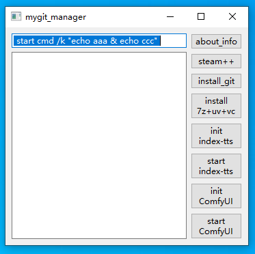

# mygit



简易的图形界面管理你的git项目，支持自定义添加按钮，自由的添加git项目，例如comfyui，forgeui。

按钮1：该项目的GitHub地址

按钮2： GitHub加速工具

按钮3：安装7z，uv，vc，并创建一个初始环境

以后为自定义按钮，init初始化项目，start启动项目

克隆仓库后把custom_buttons copy.yaml修改为custom_buttons.yaml

修改custom_buttons.yaml文件的内容就可以自定义按钮

以下是自定义按钮范例，注意yaml文件缩进敏感，label是按钮名称，popup为start时弹出新窗口运行cmd命令，command为cmd脚本命令：

```yaml
- label: "init\nindex-tts"
  popup: "start"
  command: |-
    if not exist index-tts (git clone https://github.com/index-tts/index-tts.git)
    cd index-tts
    echo. & git lfs install & git lfs pull 
    echo. & uv venv --allow-existing & uv sync --extra webui
    echo. & .venv\Scripts\hf download IndexTeam/IndexTTS-2 --local-dir=checkpoints
    echo. & uv run tools/gpu_check.py 

- label: "start\nindex-tts"
  popup: ""
  command: |-
    echo. & echo ---启动大概一分钟左右，完成后刷新网页即可
    cd index-tts & start http://127.0.0.1:7860 & uv run webui.py

- label: "init\nComfyUI"
  popup: ""
  command: |-
    set comfyuiurl=https://github.com/comfyanonymous/ComfyUI/releases/latest/download/ComfyUI_windows_portable_nvidia.7z
    if not exist .comfyui.7z curl -#fkL %comfyuiurl% -o .comfyui.7z    
    .7z\7z x .comfyui.7z -aos -bsp1

- label: "start\nComfyUI"
  popup: ""
  command: |-
    echo. & echo ---启动大概一分钟左右
    cd ComfyUI_windows_portable & run_nvidia_gpu_fast_fp16_accumulation.bat
```
